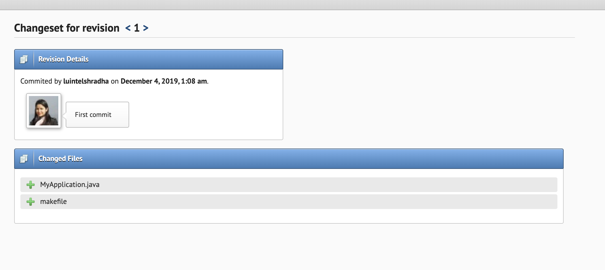

# SVN Server
Since SVN system is based on centralized model where source code and it's history is saved in server, We need server to host our application's repository. I found a <a href="https://riouxsvn.com">free svn repository hosting service</a> so created an account and got my server url as below

https://svn.riouxsvn.com/luintelapp

## SVN Client
Following are the commands i used to 
  - initially check out the empty repo from the server
  - add files to the repo
  - then finally commit
  
```
 svn co https://svn.riouxsvn.com/luintelapp --username luintelshradha
 svn add makefile
 svn add MyApplication.java
 svn commit -m "First commit"
```

`svn commit` updates the source code to the server, so when i checked the server, i saw my commit there. 
<br/><br/>



## SVN Log
I have added the logs of the svn commands in the following GIST file.
<a href="https://gist.github.com/shradz27/8ed4fc6a2e07a8afa2f6c824429348e6">Link to SVN logs gist</a>

## GIT Log
Similary, here is the log file that contains my git command and the output logs.
<a href="https://gist.github.com/shradz27/13983ccbcc979fdecc7faae9494db76d">Link to GIT logs gist</a>
